<div align="center">

# 🌿 Komorebi

**An anime-avatar virtual assistant that lives on your desktop — local by default, cloud when you need it, with eyes, ears, and hands.**


</div>

> *Komorebi (木漏れ日)* — Japanese for "sunlight filtering through the leaves of trees".
> A small, warm presence that's just *there* while you work.

Komorebi is a Tauri 2 desktop companion built around a Live2D avatar that can
**see your screen, hear you, talk back, and take real actions** on your
machine when you ask it to. It runs fully offline with local models
(`llama.cpp`, Piper, `whisper.cpp`) and falls back to OpenRouter cloud models
when you want extra power — with a smart router that picks between them
automatically per message.

Think of it as a cute, always-on pair-programmer / study buddy / game-coach
that lives in your system tray.

---

## Table of contents

- [Highlights](#highlights)
- [Architecture](#architecture)
  - [System overview](#system-overview)
  - [Workspace layout](#workspace-layout)
  - [Backend module map](#backend-module-map)
  - [Frontend module map](#frontend-module-map)
- [Runtime data flows](#runtime-data-flows)
  - [Chat request lifecycle](#chat-request-lifecycle)
  - [Smart routing decision](#smart-routing-decision)
  - [Voice loop](#voice-loop)
  - [RAG indexing & query](#rag-indexing--query)
  - [Live2D rendering pipeline](#live2d-rendering-pipeline)
  - [Proactive agent loop](#proactive-agent-loop)
  - [Feedback telemetry queue](#feedback-telemetry-queue)
- [Feature tour](#feature-tour)
- [Installing from a release](#installing-from-a-release)
- [Developer setup](#developer-setup)
- [Build features & profiles](#build-features--profiles)
- [Configuration](#configuration)
- [Tauri command catalogue](#tauri-command-catalogue)
- [Live2D / Cubism integration](#live2d--cubism-integration)
- [Privacy & telemetry](#privacy--telemetry)
- [Desktop automation & safety](#desktop-automation--safety)
- [Keyboard shortcuts](#keyboard-shortcuts)
- [CI / CD](#ci--cd)
- [Roadmap](#roadmap)
- [Contributing](#contributing)
- [License & third-party notices](#license--third-party-notices)
- [Trademarks & disclaimers](#trademarks--disclaimers)

---

## Highlights

- 🎭 **Anime avatar, not a chat box.** A Live2D model (Cubism 2 / 3 / 4 / 5
  all supported) with idle blinking, pointer-driven eye-tracking,
  tap-to-react motions, emotion-driven expression mapping, and proper
  lip-sync tied to the active TTS engine.
- 🧠 **Hybrid LLM routing.** Local models via `llama.cpp` (GGUF) for
  privacy/offline; OpenRouter for frontier quality; a small classifier
  picks the right backend per message — and you can pin a *separate*
  tiny GGUF as the classifier so your big chat model stays cold for
  trivial prompts.
- 🗣️ **Three TTS engines.** Local
  [Piper](https://github.com/rhasspy/piper) (offline, MIT), HTTP
  [GPT-SoVITS](https://github.com/RVC-Boss/GPT-SoVITS) for voice cloning,
  and OpenRouter audio models (`openai/gpt-4o-audio-preview`,
  `openai/gpt-audio`, …) for cloud TTS with selectable voices. Prosody
  (pitch, speed, noise) and master volume are tunable from the UI.
- 🎤 **Four STT backends.** Bundled `whisper.cpp` (offline, free),
  self-hosted Faster-Whisper (~4× faster, free, fully offline),
  OpenRouter audio models (cloud, generic), and Deepgram Nova-3
  (cloud, ~$0.004/min). Picked transparently in the order
  Deepgram → Faster-Whisper → OpenRouter → bundled Whisper.
- 📚 **RAG over your folders.** Drop in directories; Komorebi indexes them
  locally (SQLite + chunked text + FTS5 search) and cites them when
  answering.
- 👁️ **Vision & screenshots.** Full-screen or region capture; vision
  prompts to multimodal LLMs; sandboxed file I/O for tool use.
- 🦾 **Desktop automation.** Mouse, keyboard, virtual desktops, process
  & active-window awareness, top-CPU snapshots — all gated behind
  explicit settings toggles and a workspace path sandbox.
- 💡 **Proactive agent.** Optional background loop notices long idle,
  long browsing, long IDE focus, or running games and offers help
  without being asked. Cooldowns prevent nagging.
- 💗 **Affinity / relationship state.** Persistent user-friendly state
  (name, language, relationship "stage") that gently warms the
  persona over time, with NSFW/visibility gating.
- 🛰️ **Auto-updater.** Tauri-signed `latest.json` published from CI for
  zero-friction upgrades.
- 🔒 **Privacy first.** Telemetry is opt-in, hashed (SHA-256), batched,
  and the raw prompt/response never leaves your machine.

---

## Architecture

### System overview

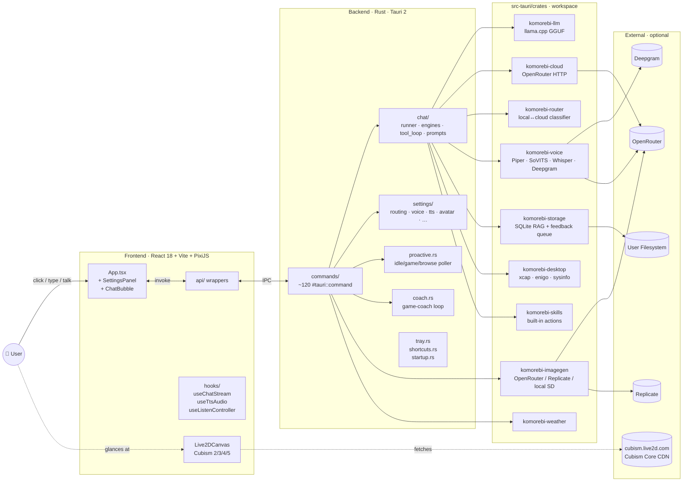

### Workspace layout

```
interactive_assistent/
├── README.md                    ← you are here
├── LICENSE / LICENSE-APACHE / LICENSE-MIT / NOTICE
├── package.json                 ← frontend deps + scripts
├── vite.config.ts               ← Vite bundler config
├── index.html                   ← SPA entry
├── tsconfig.json                ← TS app config
├── tsconfig.node.json           ← TS tooling config
│
├── src/                         ← React + TypeScript frontend
│   ├── main.tsx · App.tsx       ← bootstrap + root
│   ├── api/                     ← Tauri command wrappers (typed)
│   ├── components/              ← UI (TopBar, ChatBubble, Live2DCanvas,
│   │                              ModelWizard, RegionPicker, SettingsPanel)
│   ├── hooks/                   ← chat / TTS / STT / image hooks
│   ├── i18n/                    ← en · ru · uk locales
│   ├── avatarState.ts           ← shared avatar state
│   ├── emotion.ts               ← emotion → expression mapping
│   ├── lipsync.ts               ← TTS-driven mouth animation
│   ├── listen.ts · vad.ts       ← STT lifecycle / VAD
│   ├── updater.ts               ← Tauri auto-updater glue
│   └── styles.css
│
├── src-tauri/                   ← Rust backend root
│   ├── Cargo.toml               ← workspace + features (local-llm, stt, full)
│   ├── tauri.conf.json          ← bundle, identifier, signer
│   ├── binaries/piper/…         ← bundled Piper TTS (downloaded by fetch:piper)
│   ├── icons/…                  ← app icons
│   └── src/
│       ├── lib.rs · main.rs
│       ├── commands/            ← #[tauri::command] entry points
│       ├── chat/                ← runner, engines, tool_loop, prompts, rag, vision
│       ├── settings/            ← per-domain settings persistence
│       ├── relationship/        ← affinity stage state machine
│       ├── coach.rs             ← game-coach agent
│       ├── proactive.rs         ← idle / activity poller
│       ├── feedback.rs          ← telemetry queue + uploader task
│       ├── imagegen.rs · models.rs · sysctx.rs · tools.rs
│       ├── tray.rs · shortcuts.rs · startup.rs · weather.rs
│       └── …
│
├── src-tauri/crates/            ← workspace members
│   ├── llm/                     ← llama.cpp wrapper (feature: local-llm)
│   ├── cloud/                   ← OpenRouter HTTP client
│   ├── router/                  ← local↔cloud classifier traits
│   ├── voice/                   ← TTS + STT (feature: stt)
│   │   ├── openrouter/          ← split into mod / tts / stt / wav
│   │   ├── piper.rs · sovits.rs
│   │   ├── whisper.rs · faster_whisper.rs · deepgram.rs
│   │   └── audio_io.rs
│   ├── storage/                 ← SQLite
│   │   ├── rag/                 ← split into mod / chunker / schema / index / search
│   │   └── feedback.rs          ← hashed telemetry queue
│   ├── desktop/                 ← xcap, enigo, sysinfo, virtual desktop
│   ├── skills/                  ← built-in skill registry (volume, clipboard, open, …)
│   ├── imagegen/                ← OpenRouter / Replicate / local SD
│   └── weather/                 ← weather provider abstraction
│
├── public/
│   ├── live2d/                  ← bundled sample model + per-model README
│   │   ├── README.md
│   │   └── mao_pro/             ← Cubism 5 sample (Live2D Free Material License)
│   └── (optional) live2dcubismcore.min.js · live2d.min.js
│
├── scripts/
│   ├── fetch-piper.mjs          ← downloads Piper into src-tauri/binaries/
│   └── make-icon.py             ← generates icons at multiple resolutions
│
├── docs/
│   └── adr/                     ← Architecture Decision Records
│       ├── 0001-feedback-telemetry.md
│       ├── 0002-local-personality-lora.md
│       ├── 0003-federated-lora-upload.md
│       ├── 0004-aggregation-release-pipeline.md
│       └── 0005-transparency-log-revocation.md
│
└── .github/workflows/
    ├── ci.yml                   ← typecheck / clippy / cargo test / feature checks
    └── release.yml              ← signed NSIS installer + latest.json
```

### Backend module map

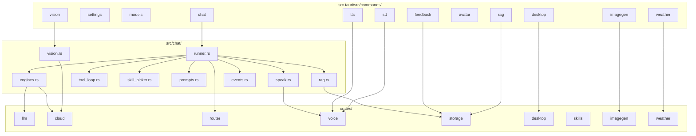

### Frontend module map

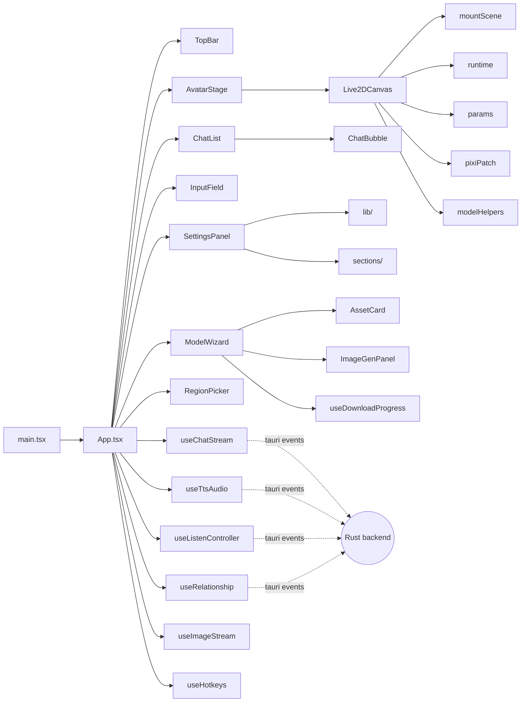

---

## Runtime data flows

### Chat request lifecycle

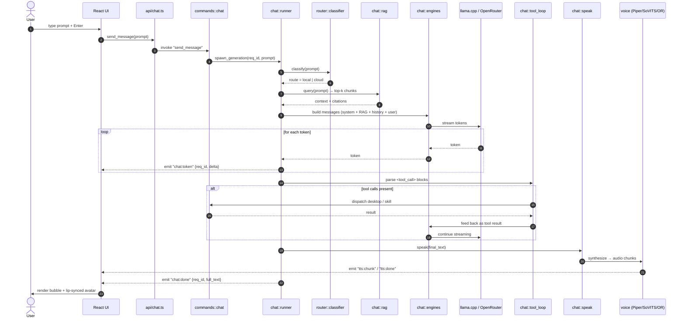

### Smart routing decision

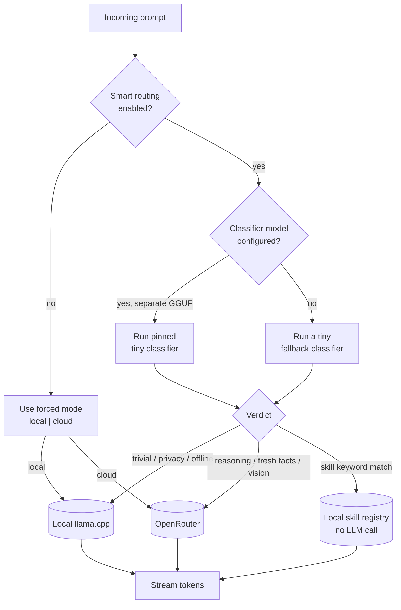

### Voice loop

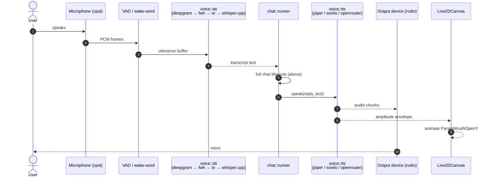

### RAG indexing & query

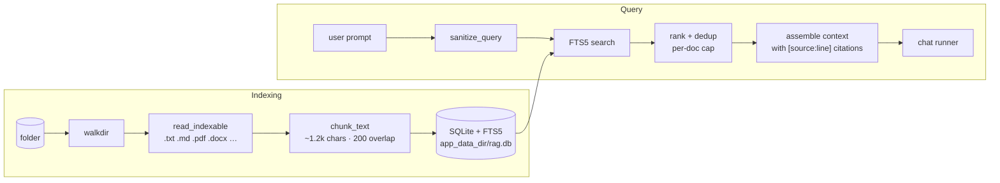

### Live2D rendering pipeline

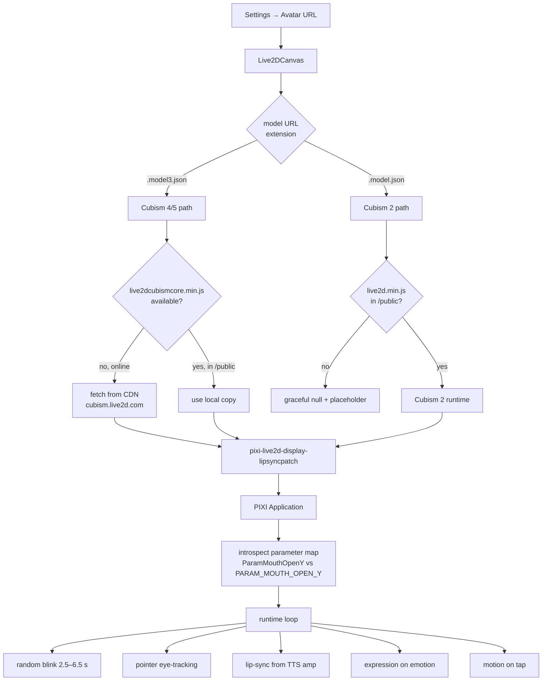

### Proactive agent loop

```mermaid
stateDiagram-v2
    [*] --> Idle
    Idle --> Polling: "every ~30 s\n(if enabled)"
    Polling --> Snapshot: "sysctx::context_snapshot()"
    Snapshot --> ClassifyActivity
    ClassifyActivity --> GameSession: "is_gaming = true"
    ClassifyActivity --> CodingSession: "ide active long"
    ClassifyActivity --> Browsing: "browser active long"
    ClassifyActivity --> LongIdle: "idle ≥ 3 min"
    ClassifyActivity --> Polling: "nothing notable"
    GameSession --> Cooldown: "emit 'take a break'"
    CodingSession --> Cooldown: "emit 'need a hand?'"
    Browsing --> Cooldown: "emit 'want a summary?'"
    LongIdle --> Cooldown: "emit 'still here'"
    Cooldown --> Polling: "10 min lockout"
```

### Feedback telemetry queue

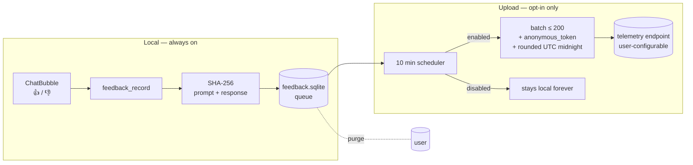

---

## Feature tour

### LLM & chat routing

| Knob | Where | Notes |
|---|---|---|
| Force local / force cloud / auto | `set_mode` | Auto = router classifier |
| Smart routing toggle | `set_smart_routing` | When off, always uses forced mode |
| Pinned classifier model | `set_local_classifier_model` | Use a tiny GGUF (e.g. Qwen2.5-0.5B) so the chat model stays unloaded for trivial prompts |
| OpenRouter model | `set_openrouter_model` | Catalog fetched live with `list_openrouter_models` |
| GPU offload layers | `set_llm_gpu_layers` | llama.cpp `n_gpu_layers` |
| Tool calls | `set_chat_tool_calls_enabled` | Disable to reduce false-positive tool firings on small models |
| RAG | `set_rag_enabled` | Inline citations: `[source:line]` |

### TTS — three engines

| Engine | Mode | Config commands |
|---|---|---|
| **Piper** | Local | `set_piper_binary`, `set_piper_voice` |
| **GPT-SoVITS** | Self-hosted HTTP | `set_sovits_config(endpoint, ref_audio, prompt_text, ...)` |
| **OpenRouter audio** | Cloud | `set_openrouter_tts_*` |

Live-tunable: `set_tts_prosody(length_scale, noise_scale, noise_w)`,
`set_tts_volume`. Lip-sync amplitude is fed into
`Live2DCanvas` regardless of engine.

### STT — four backends, picked top-down

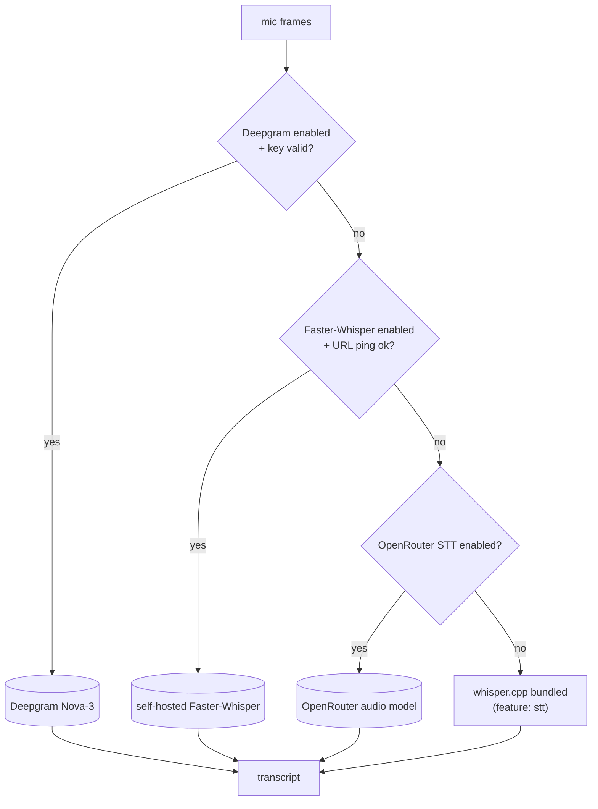

### RAG

- Walks selected folders; supported file types include `.txt`, `.md`,
  `.pdf` (via `pdf-extract`), `.docx`, source files, etc.
- Chunks at ~1.2 k chars with 200-char overlap; stores in SQLite +
  FTS5 at `app_data_dir/rag.db`.
- Citations are inlined as `[source:line]` so models can quote sources.
- Operations: `rag_add_folder`, `rag_remove_folder`, `rag_list_folders`,
  `rag_reindex`.

### Vision

- `vision_capture_full(monitor?)` and `vision_capture_region(x, y, w, h, monitor?)`
  return raw PNG bytes via [`xcap`](https://crates.io/crates/xcap).
- `vision_with_image(image_b64, prompt)` sends to a multimodal cloud
  model and streams back text.
- `RegionPicker` component overlays a translucent mask for
  rectangle-drag selection.

### Desktop automation

All gated behind `set_desktop_automation_enabled(true)`. Sandboxed
file I/O is rooted at `desktop_workspace_root` (default
`{Documents}/Komorebi`).

| Capability | Commands |
|---|---|
| Screen capture | `desktop_screenshot`, `desktop_screenshot_region`, `desktop_list_screens` |
| Mouse | `desktop_click`, `desktop_move_cursor`, `desktop_scroll` |
| Keyboard | `desktop_type`, `desktop_key("Ctrl+Shift+P")` |
| Process / window | `desktop_top_processes`, `desktop_active_window`, `desktop_context_snapshot` |
| Sandboxed FS | `desktop_read_file`, `desktop_write_file`, `desktop_list_dir` (rel-path only) |
| Virtual desktop (Windows) | `desktop_vd_switch_left/right`, `desktop_vd_create`, `desktop_vd_close`, `desktop_vd_task_view` |

### Image generation

- Providers: OpenRouter, Replicate, local Stable Diffusion binary.
- Tunables: model, size, steps, negative prompt, device.
- Stream events: `image:start`, `image:progress`, `image:done`.

### Game coach (optional)

- Activates while a recognised game is in focus.
- `set_game_coach_use_vision(true)` adds periodic screenshot reasoning;
  otherwise pure-text mode.

### Relationship state

- Persistent stage progression based on interaction count, ratings, and
  session continuity.
- NSFW gating (`set_relationship_nsfw_allowed`), visibility gating, and
  decay (`set_relationship_decay_enabled`) for hygiene.
- Self-introduction extraction: the model is asked once for a polite
  greeting that matches the chosen persona and language.

### Auto-updater

- Reads signed `latest.json` published by `release.yml`.
- Signing keys are GitHub Actions secrets:
  `TAURI_SIGNING_PRIVATE_KEY`, `TAURI_SIGNING_PRIVATE_KEY_PASSWORD`.

---

## Installing from a release

1. Grab the latest `Komorebi_<version>_x64-setup.exe` from the
   [Releases page](https://github.com/kiskaserver/interactive_assistent/releases).
2. Run the installer. Komorebi installs into `%LOCALAPPDATA%\Programs\komorebi`
   and creates a Start-menu shortcut.
3. First launch:
   - The default `mao_pro` Live2D model is rendered against the CDN-fetched
     Cubism Core. If you are offline, see
     [Live2D / Cubism integration](#live2d--cubism-integration).
   - Open **Settings** to add an OpenRouter key (optional) and a local
     GGUF model.

> Auto-update will pick up subsequent releases.

---

## Developer setup

### Prerequisites

| Tool | Version |
|---|---|
| Rust toolchain | stable (target: `x86_64-pc-windows-msvc` on Windows) |
| Node.js | ≥ 24 |
| pnpm | 10 |
| Tauri 2 toolchain | per [tauri.app/start/prerequisites](https://tauri.app/start/prerequisites/) |
| (Optional) CMake + LLVM | required for `local-llm` and `stt` features |

### Clone & run

```bash
# install deps
pnpm install

# fetch Piper TTS binary into src-tauri/binaries/piper
pnpm fetch:piper

# dev (no local-llm, no stt by default; faster build)
pnpm tauri dev

# full feature build (local llama.cpp + bundled whisper.cpp)
pnpm tauri dev -- --features full

# typecheck only
pnpm typecheck

# lint
pnpm lint

# Rust tests
cd src-tauri && cargo test --workspace
```

### Production build

```bash
pnpm tauri build --target x86_64-pc-windows-msvc -- --features full
```

Output: `src-tauri/target/x86_64-pc-windows-msvc/release/bundle/nsis/`.

---

## Build features & profiles

```toml
# src-tauri/Cargo.toml — features
default   = []
local-llm = ["komorebi-llm/local-llm"]    # llama.cpp via llama-cpp-2 (CMake)
stt       = ["komorebi-voice/stt"]        # bundled whisper.cpp via whisper-rs (CMake)
full      = ["local-llm", "stt"]          # ship everything (used by release.yml)
```

| Profile | Use case |
|---|---|
| `release` | LTO, single codegen unit, stripped — published builds |
| `release-fast` | Thin LTO — quick local release builds |
| `dev` | Optimised deps, unoptimised app code — daily dev |

---

## Configuration

Settings are persisted via `tauri-plugin-store` (JSON) inside the OS app-data
directory. Each domain owns its own file under `settings/`:

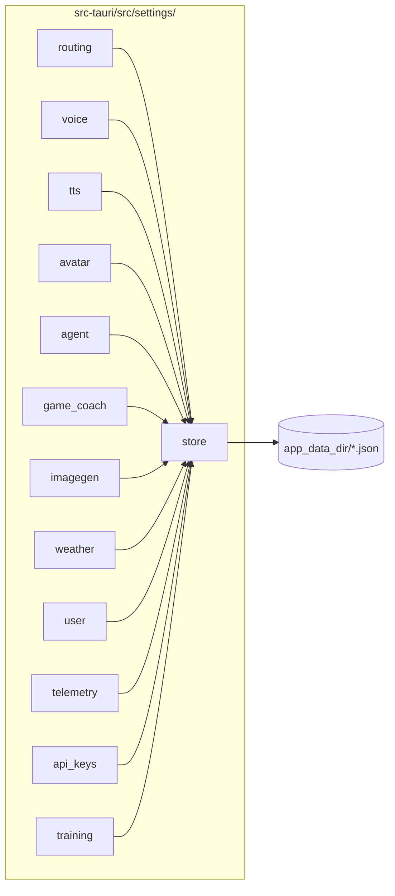

API keys (`api_keys.rs`) are stored separately so they can be cleared
independently and never leave the machine unless explicitly used to call the
upstream service.

---

## Tauri command catalogue

A condensed catalogue of the public IPC surface (~120 commands across
~9 modules under `src-tauri/src/commands/`). Full type signatures live
in [src/api/types.ts](src/api/types.ts) and the corresponding Rust files.

| Domain | Commands (selection) |
|---|---|
| Chat | `send_message`, `cancel_generation`, `reset_chat` |
| Settings / system | `get_settings`, `system_info`, `set_mode`, `set_language`, `get_resolved_language` |
| Routing & models | `set_smart_routing`, `set_classifier_model`, `set_openrouter_model`, `list_openrouter_models`, `set_llm_gpu_layers`, `set_chat_tool_calls_enabled`, `set_rag_enabled` |
| Asset catalogue | `list_assets`, `download_asset`, `delete_asset`, `set_local_model`, `set_local_classifier_model`, `clear_local_classifier_model` |
| TTS | `set_tts_enabled`, `set_tts_provider`, `set_tts_prosody`, `set_tts_volume`, `set_piper_binary`, `set_piper_voice`, `set_sovits_config`, `set_openrouter_tts_*`, `speak_text`, `speak_reaction`, `react_event`, `read_tts_bytes` |
| STT | `set_whisper_model`, `start_recording`, `stop_recording`, `cancel_recording`, `set_wake_word`, `set_listen_enabled`, `set_auto_listen`, `set_openrouter_stt_*`, `set_faster_whisper_*`, `validate_faster_whisper`, `set_deepgram_*`, `validate_deepgram_key`, `list_audio_devices`, `set_audio_input`, `set_audio_output` |
| RAG | `rag_list_folders`, `rag_add_folder`, `rag_remove_folder`, `rag_reindex` |
| Vision | `vision_capture_full`, `vision_capture_region`, `vision_with_image`, `enter_region_picker_mode`, `exit_region_picker_mode` |
| Avatar | `set_avatar_zoom`, `set_avatar_offset`, `set_live2d_model` |
| Desktop | `desktop_screenshot*`, `desktop_click`, `desktop_move_cursor`, `desktop_type`, `desktop_key`, `desktop_scroll`, `desktop_top_processes`, `desktop_active_window`, `desktop_context_snapshot`, `desktop_read_file`, `desktop_write_file`, `desktop_list_dir`, `desktop_vd_*`, `desktop_workspace_root`, `desktop_set_workspace` |
| Agent | `set_proactive_enabled`, `set_desktop_automation_enabled`, `set_auto_screen_watch_enabled` |
| Game coach | `set_game_coach_enabled`, `set_game_coach_model`, `set_game_coach_use_vision` |
| Image gen | `generate_image`, `cancel_image_generation`, `save_generated_image`, `set_imagegen_provider`, `set_imagegen_*_model`, `set_imagegen_size`, `set_imagegen_steps`, `set_imagegen_negative_prompt`, `set_imagegen_device`, `set_replicate_token`, `clear_replicate_token` |
| Weather | `get_weather`, `set_weather_provider`, `set_weather_api_key`, `clear_weather_api_key`, `set_weather_default_city`, `set_weather_use_ip`, `set_weather_units` |
| Relationship | `get_relationship_state`, `reset_relationship`, `set_user_name`, `set_relationship_visibility`, `set_relationship_nsfw_allowed`, `set_relationship_decay_enabled` |
| Telemetry | `feedback_record`, `feedback_stats`, `feedback_purge`, `set_telemetry_enabled`, `set_telemetry_endpoint` |
| Training (Phase 2 stub) | `set_training_enabled`, `set_training_max_cpu_pct` |

Frontend wrappers mirror this surface 1:1 under [src/api/](src/api/).

---

## Live2D / Cubism integration

> **Komorebi is not affiliated with Live2D Inc.** The project uses the
> public Cubism Web SDK runtime as a separate, proprietary dependency.
> See [License & third-party notices](#license--third-party-notices)
> and the [NOTICE](NOTICE) file.

### What is bundled vs fetched

| Item | Source | License |
|---|---|---|
| `pixi-live2d-display-lipsyncpatch` | npm package | MIT (upstream) |
| `mao_pro` sample model | `public/live2d/mao_pro/` | Live2D **Free Material License Agreement** |
| `live2dcubismcore.min.js` (Cubism 4/5 runtime) | **NOT bundled.** Fetched at runtime from `https://cubism.live2d.com/sdk-web/cubismcore/live2dcubismcore.min.js`, or supplied by the end user under `public/live2dcubismcore.min.js` | Live2D Proprietary — user must accept Live2D EULA |
| `live2d.min.js` (Cubism 2 runtime) | **NOT bundled.** Optional, supplied by the end user under `public/live2d.min.js` for legacy `.model.json` models | Per upstream license |

### Loading flow

See the [Live2D rendering pipeline](#live2d-rendering-pipeline) diagram
above. Highlights:

- Model URL extension drives runtime selection
  (`.model3.json` → Cubism 4/5; `.model.json` → Cubism 2).
- Parameter naming differs across runtimes; resolved by introspection
  in [src/components/Live2DCanvas/params.ts](src/components/Live2DCanvas/params.ts).
- If the Cubism Core fails to load, the canvas component returns
  `null`, and the parent shows a placeholder rather than crashing.

### Adding your own model

1. Drop the runtime folder under `public/live2d/yourmodel/` so it
   contains `yourmodel.model3.json` plus its textures, motions,
   physics, and expression files.
2. In **Settings → Avatar**, set the model URL to
   `/live2d/yourmodel/yourmodel.model3.json`.
3. For legacy Cubism 2 models, also place `live2d.min.js` in `public/`.

---

## Privacy & telemetry

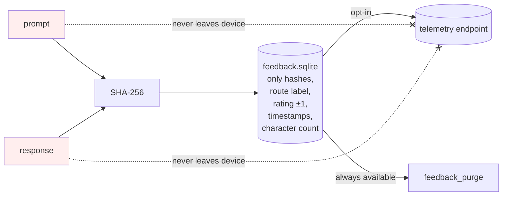

- The raw user prompt and model response are **never** transmitted.
- Telemetry is **off by default**. When enabled, batches contain only
  hashes + route + rating + day-rounded timestamp + anonymous token.
- The anonymous token is a random UUID minted on first opt-in,
  rotatable and purgeable.
- All cloud features (OpenRouter, Deepgram, Replicate, Weather,
  OpenRouter audio TTS/STT) require user-supplied keys and only
  activate when explicitly enabled.

For the full design, see
[docs/adr/0001-feedback-telemetry.md](docs/adr/0001-feedback-telemetry.md).

---

## Desktop automation & safety

- Disabled by default; toggle in **Settings → Agent**.
- LLM-driven file I/O is restricted to the configured workspace root
  (default `{Documents}/Komorebi`); path traversal is rejected.
- Tool calls are parsed from a strict `<tool_call>` XML envelope
  (`src-tauri/src/chat/tool_loop.rs`); malformed calls trigger a
  bounded retry rather than ad-hoc execution.
- The proactive agent honours a 10-minute cooldown; you can disable
  it with `set_proactive_enabled(false)`.

---

## Keyboard shortcuts

Global hotkeys (registered via `tauri-plugin-global-shortcut`,
configured in `src-tauri/src/shortcuts.rs`):

| Action | Default |
|---|---|
| Toggle main window | `Ctrl+Alt+K` |
| Push-to-talk | `Ctrl+Alt+L` |
| Region screenshot picker | `Ctrl+Alt+R` |

Most can be re-bound from the settings panel.

---

## CI / CD

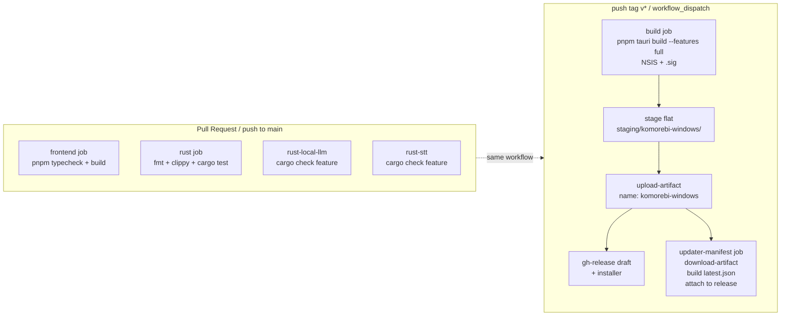

- `ci.yml` — runs on every push to `main` and PR; blocks on
  `RUSTFLAGS=-D warnings`.
- `release.yml` — builds the Windows installer, uploads it as a flat
  artifact under `staging/komorebi-windows/`, and assembles
  `latest.json` with Tauri-signed signature for the auto-updater.

---

## Roadmap

- **v1.8 (released)** — architectural refactor: split 12 monolithic
  files into module folders without behavior change. New local skill
  classifier; OpenRouter `complete_text()` helper; coach `run_vision` /
  `run_text` split; release pipeline NSIS pre-flight & flat artifact
  layout for reliable updater manifest generation.
- **v1.9 (planned)** — local personality LoRA fine-tuning
  ([ADR 0002](docs/adr/0002-local-personality-lora.md)) — opt-in,
  on-device, derived from positively-rated turns.
- **v2.0 (proposed)** — federated LoRA aggregation
  ([ADR 0003](docs/adr/0003-federated-lora-upload.md),
  [ADR 0004](docs/adr/0004-aggregation-release-pipeline.md))
  with transparency log and revocation
  ([ADR 0005](docs/adr/0005-transparency-log-revocation.md)).

---

## Contributing

PRs and issues are welcome. Before opening a PR:

1. `pnpm typecheck && pnpm lint`
2. `cd src-tauri && cargo fmt && cargo clippy --all-targets -- -D warnings && cargo test --workspace`
3. For frontend changes that touch IPC, keep `src/api/types.ts` in sync
   with the Rust `PublicSettings` shape.
4. For new Tauri commands, add the command handler **and** the typed
   wrapper under `src/api/`.

By submitting a contribution you agree your work is dual-licensed
under Apache-2.0 OR MIT, per the LICENSE file.

---

## License & third-party notices

Komorebi is **dual-licensed** under either of:

- [Apache License, Version 2.0](LICENSE-APACHE)
- [MIT License](LICENSE-MIT)

at your option. See [LICENSE](LICENSE) for the canonical statement.

### Third-party components — read this if you redistribute

The dual Apache/MIT license above applies **only** to original
Komorebi source code. The following are **separate** and have **their
own licenses**, which downstream redistributors must honour. Full
details are in [NOTICE](NOTICE).

| Component | Status in repo | License |
|---|---|---|
| **Live2D Cubism Core for Web** (`live2dcubismcore.min.js`) | **Not bundled.** Fetched at runtime from Live2D's CDN, or supplied locally by the end user. | **Proprietary — © Live2D Inc.** Use governed by Live2D's [Proprietary Software License Agreement](https://www.live2d.com/eula/live2d-proprietary-software-license-agreement_en.html) and, for distribution, the [Cubism SDK Release License](https://www.live2d.com/en/sdk/license/). Komorebi neither redistributes nor sublicenses Cubism Core. |
| **Live2D sample model `mao_pro`** (`public/live2d/mao_pro/`) | Bundled for first-run convenience | © Live2D Inc., used under the [Free Material License Agreement](https://www.live2d.com/eula/live2d-free-material-license-agreement_en.html) |
| `pixi-live2d-display-lipsyncpatch` | npm runtime dep | MIT |
| PixiJS | npm runtime dep | MIT |
| Piper TTS binary | bundled by `pnpm fetch:piper` | MIT |
| `whisper.cpp` (via `whisper-rs`) | linked when `stt` feature on | MIT |
| `llama.cpp` (via `llama-cpp-2`) | linked when `local-llm` feature on | MIT |
| Tauri | runtime dep | Apache-2.0 OR MIT |

### Trademarks & disclaimers

- "Live2D" and "Cubism" are trademarks or registered trademarks of
  **Live2D Inc.** in Japan and other countries. Their use in this
  repository is purely descriptive — Komorebi is **not** developed,
  endorsed, sponsored, or supported by Live2D Inc.
- All other trademarks are the property of their respective owners.
- This software is provided "AS IS", without warranty of any kind.
  See [LICENSE-APACHE](LICENSE-APACHE) §7–§8 and [LICENSE-MIT](LICENSE-MIT)
  for the full disclaimer.

---

<div align="center">

Made with sleepy eyes and lots of tea by the Komorebi contributors.

</div>
